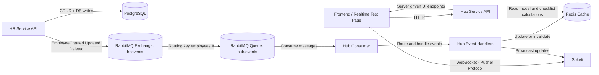

# Event-Driven Multi-Country HR Platform

A real-time, event-driven backend platform built with Laravel that demonstrates event-driven architecture, real-time WebSocket communications, server-driven UI patterns, multi-country data handling, and intelligent caching strategies.

---

## Table of Contents

- [Event-Driven Multi-Country HR Platform](#event-driven-multi-country-hr-platform)
  - [Table of Contents](#table-of-contents)
  - [Overview](#overview)
  - [Technology Stack](#technology-stack)
    - [Key Packages](#key-packages)
  - [Design Decisions and Tradeoffs](#design-decisions-and-tradeoffs)
    - [RabbitMQ Topology](#rabbitmq-topology)
    - [Caching Strategy](#caching-strategy)
    - [Real-Time WebSocket Channels](#real-time-websocket-channels)
    - [Trade-offs](#trade-offs)
    - [Separating Message Processing from the Queue Job](#separating-message-processing-from-the-queue-job)
    - [Redis as the Hub Read Model Instead of a Database](#redis-as-the-hub-read-model-instead-of-a-database)
    - [Direct RabbitMQ Publishing from the HR Service](#direct-rabbitmq-publishing-from-the-hr-service)
    - [Public WebSocket Channels](#public-websocket-channels)
    - [No Explicit Idempotency Layer](#no-explicit-idempotency-layer)
  - [Potential Improvements](#potential-improvements)
  - [Architecture](#architecture)
  - [Data Flow](#data-flow)
  - [Getting Started](#getting-started)
    - [Prerequisites](#prerequisites)
    - [Start the System](#start-the-system)
    - [Access Points](#access-points)
  - [API Reference](#api-reference)
    - [HR Service (`:8081`)](#hr-service-8081)
    - [Hub Service (`:8082`)](#hub-service-8082)
  - [Testing](#testing)
    - [Test Coverage](#test-coverage)

---

## Overview

The system is composed of two Laravel services communicating through RabbitMQ and broadcasting real-time updates via WebSockets through Soketi.

- **HR Service**: This is the source of truth for employee data. It exposes REST CRUD endpoints and publishes domain events to RabbitMQ when data changes.
- **Hub Service** — This is the central orchestration layer. It consumes events, maintains a Redis-backed read model, computes checklist completion, serves server-driven UI APIs, and broadcasts real-time updates to frontend clients.

The platform currently supports **USA** and **Germany** as country configurations and is designed to be extended to additional countries with minimal changes.

---

## Technology Stack

| Component          | Technology              | Version                    |
| ------------------ | ----------------------- | -------------------------- |
| Language           | PHP                     | 8.4                        |
| Framework          | Laravel                 | 12.x                       |
| Database           | PostgreSQL              | 16                         |
| Message Queue      | RabbitMQ                | 3                          |
| Cache / Read Model | Redis                   | 7                          |
| WebSocket Server   | Soketi                  | Latest (Pusher-compatible) |
| Containerization   | Docker & Docker Compose | -                          |

### Key Packages

| Package                                     | Service | Purpose                                |
| ------------------------------------------- | ------- | -------------------------------------- |
| `vladimir-yuldashev/laravel-queue-rabbitmq` | Both    | RabbitMQ queue driver for Laravel      |
| `pusher/pusher-php-server`                  | Hub     | Server-side Pusher/Soketi broadcasting |
| `predis/predis`                             | Hub     | Redis client for PHP                   |

---

## Design Decisions and Tradeoffs

### RabbitMQ Topology

| Component | Name                       | Type                       |
| --------- | -------------------------- | -------------------------- |
| Exchange  | `hr.events`                | Topic                      |
| Queue     | `hub.events`               | Durable                    |
| Binding   | `hub.events` ← `hr.events` | Routing key: `employees.#` |

The Hub Consumer container automatically declares the exchange, queue, and bindings during startup before beginning message consumption.

The consumer runs with retries using Laravel's internal job retry abilities with a maximum of 3 attempts:

```php
// hub-service/app/Infrastructure/Messaging/RabbitMQJob.php
public int $tries = 3;
```

The `RabbitMQMessageProcessor` differentiates between retryable errors (runtime exceptions, transient failures) and non-retryable errors (invalid payloads, unsupported event types). Invalid payloads are immediately failed without retry.

---

### Caching Strategy

The Hub Service uses **Redis** as its primary data store — functioning as a projection/read model rather than a traditional cache layer.

**What is cached:**

| Data                     | Key Pattern              | Invalidation Trigger                    |
| ------------------------ | ------------------------ | --------------------------------------- |
| Employee snapshots       | Per-country Redis hashes | Employee created/updated/deleted events |
| Paginated employee lists | Per-country, per-page    | Employee created/updated/deleted events |
| Checklist summaries      | Per-country              | Employee created/updated/deleted events |

**Why Redis:**

The Hub Service functions as a projection and aggregation layer. It does not own the source data — the HR Service does. Redis provides extremely fast reads, simple key-based invalidation, and lightweight infrastructure appropriate for this architecture. Checklist calculations are expensive (fetching all employees, running validation rules, computing percentages), making caching essential for performance.

**Cache invalidation approach:**

When an employee event is consumed, the handler invalidates the relevant cache entries (employee lists and checklist summaries for the affected country) and recomputes them. This ensures clients always receive the latest data after changes.

---

### Real-Time WebSocket Channels

The Hub Service broadcasts events to Soketi on the following public channels:

| Channel                        | Events                                                     |
| ------------------------------ | ---------------------------------------------------------- |
| `country.{code}.employees`     | `employee.created`, `employee.updated`, `employee.deleted` |
| `country.{code}.employee.{id}` | `employee.updated`, `employee.deleted`                     |
| `country.{code}.checklists`    | `checklist.updated`                                        |

A test page is available at `http://localhost:8082/realtime-test` that connects to the WebSocket server, subscribes to channels, and displays events as they arrive.

---

### Trade-offs

### Separating Message Processing from the Queue Job

Instead of implementing all `RabbitMQ` payload handling logic directly inside the queue job class, I extracted the logic into a dedicated `RabbitMQMessageProcessor`.

**Rationale:** Queue jobs should focus on lifecycle concerns (acknowledgement, retry, failure handling). Messages parsing and routing logic are application-level concerns. The separation improves testability because processing logic can be tested without faking queue internals. This approach also keeps the job class focused on its single responsibility.

**Trade-off:** This approach introduces an additional class and a layer of indirection. However, the improved testability and separation of concerns outweigh the extra abstraction.

### Redis as the Hub Read Model Instead of a Database

The Hub Service projects the employee data entirely to Redis rather than a relational database.

**Rationale:** The Hub is a projection and aggregation layer, not a system of record. Redis provides extremely fast reads, simple cache invalidation, and lightweight infrastructure. The Hub never needs complex queries as it serves pre-computed data.

**Trade-off:** Redis is an in-memory store. This means that if data is lost, the read model must be rebuilt by replaying events or reloading from the HR Service. In production, I would prefer a durable projection store or a formal replay mechanism..

### Direct RabbitMQ Publishing from the HR Service

This is partly a tradeoff made as a result of a package constraint. The employee events are published directly using RabbitMQ's `basic_publish` instead of Laravel's queue abstraction which the selected RabbitMQ wrapper package uses.

**Rationale:** The Laravel queue abstraction did not reliably publish events to the configured topic exchange with the required routing keys. Direct publishing provides full control over exchange names, routing keys, and payload format.

This guarantees that events reach the correct topic exchange for the Hub service to consume.

**Trade-off:** This bypasses Laravel's queue abstraction and requires interacting with the RabbitMQ PHP library directly. While this reduces framework abstraction, it provides predictable messaging behaviour for this architecture.

### Public WebSocket Channels

Real-time events are broadcast on public channels rather than authenticated private channels.

**Rationale:** Authentication was explicitly stated as out of scope for this challenge. Private channel authorization would require authentication/authorization infrastructure that adds complexity that is out of scope for the challenge.

**Trade-off:** Public channels are not appropriate for sensitive data in production. A production system would secure these channels using authenticated private channels or by enforcing authorization policies for different channels.

### No Explicit Idempotency Layer

The Hub consumer does not implement an explicit idempotency store or inbox pattern.

**Rationale:** The event handlers perform inherently idempotent operations (cache upserts, state recomputation). Combined with bounded retry attempts, the risk of problematic reprocessing in this scope is minimal.

**Trade-off:** In critical systems (e.g., payment processing), strict idempotency guarantees via event IDs, inbox tables, or deduplication stores would be required. I choose this simpler approach to keep the architecture lightweight.

---

## Potential Improvements

For a more resilient production-grade solution, there are some improvements I will recommend if the scope of this challenge is extended.

- **Authenticated private WebSocket channels** — secure real-time updates with per-user authorization
- **Dead letter queue handling** — route permanently failed messages for inspection and manual replay
- **Observability and tracing** — distributed tracing across services, structured logging, metrics dashboards
- **Inbox/outbox pattern** — guaranteed exactly-once event processing and transactional outbox for publishing
- **Persistent projection store** — back the Hub read model with a database alongside Redis for durability
- **Horizontal scaling** — multiple consumer instances with competing consumers on the RabbitMQ queue. This will also demand the implementation of strong idempotency layers.

---

## Architecture



---

## Data Flow

1. A client creates, updates, or deletes an employee through the **HR Service** REST API
2. The HR Service persists the change to **PostgreSQL** and publishes an event to the RabbitMQ exchange `hr.events` with a routing key like `employees.USA.created`
3. The **Hub Consumer** picks up the message from the `hub.events` queue
4. The `EventRouter` dispatches the message to the appropriate handler based on `event_type`
5. The handler updates/invalidates the **Redis** cache (employee snapshot, paginated lists, checklist summaries)
6. The handler broadcasts a real-time update through **Soketi** to all subscribed WebSocket clients
7. Connected frontend clients receive the update instantly without needing to refresh the page

---

## Getting Started

### Prerequisites

- Docker and Docker Compose installed on your machine

### Start the System

```bash
docker compose up --build
```

This single command will:

1. Start **PostgreSQL**, **Redis**, **RabbitMQ**, and **Soketi**
2. Build and boot the **HR Service** and **Hub Service** containers
3. Run database migrations automatically
4. Start the **Hub Consumer**
5. Declare the RabbitMQ exchange, queue and bindings in the **Hub Consumer**

### Access Points

| Service                | URL                                                         |
| ---------------------- | ----------------------------------------------------------- |
| HR Service API         | `http://localhost:8081`                                     |
| Hub Service API        | `http://localhost:8082`                                     |
| RabbitMQ Management UI | `http://localhost:15672` (username: guest, password: guest) |
| WebSocket (Soketi)     | `ws://localhost:6001`                                       |
| Real-Time Test Page    | `http://localhost:8082/realtime-test`                       |

---

## API Reference

### HR Service (`:8081`)

A Postman collection is included at `hr-service/postman/hr-service.postman_collection.json`.

| Method   | Endpoint              | Description                |
| -------- | --------------------- | -------------------------- |
| `GET`    | `/api/employees`      | List employees (paginated) |
| `POST`   | `/api/employees`      | Create employee            |
| `GET`    | `/api/employees/{id}` | Get employee by ID         |
| `PUT`    | `/api/employees/{id}` | Update employee            |
| `DELETE` | `/api/employees/{id}` | Delete employee            |

**Create Employee (USA):**

```json
POST /api/employees
{
  "name": "Jane",
  "last_name": "Smith",
  "country": "USA",
  "salary": 75000,
  "ssn": "123-45-6789",
  "address": "456 Oak Ave, Los Angeles, CA"
}
```

**Create Employee (Germany):**

```json
POST /api/employees
{
  "name": "Klaus",
  "last_name": "Schmidt",
  "country": "Germany",
  "salary": 65000,
  "tax_id": "DE123456789",
  "goal": "Improve team efficiency"
}
```

### Hub Service (`:8082`)

A Postman collection is included at `hub-service/postman/hub-service.postman_collection.json`.

| Method | Endpoint               | Required Params | Description                                           |
| ------ | ---------------------- | --------------- | ----------------------------------------------------- |
| `GET`  | `/api/checklists`      | `country`       | Checklist completion data with per-employee status    |
| `GET`  | `/api/employees`       | `country`       | Paginated employee list with country-specific columns |
| `GET`  | `/api/steps`           | `country`       | Navigation steps for the UI                           |
| `GET`  | `/api/schema/{stepId}` | `country`       | Widget configuration for a step (e.g., dashboard)     |

---

## Testing

Both services contain automated tests covering validation rules, event publishing, checklist engine logic, cache repositories, event handlers, message processing, and API endpoints.

```bash
# Run HR Service tests
docker exec -it hr_service php artisan test

# Run Hub Service tests
docker exec -it hub_service php artisan test
```

### Test Coverage

**HR Service:**

- Feature tests: employee CRUD operations, validation rules, event publishing
- Unit tests: `EmployeeResource` transformation, `EmployeeService` business logic

**Hub Service:**

- Unit tests: `ChecklistRulesFactory`, `EmployeeCacheRepository`, `ChecklistCacheRepository`, event handlers (`EmployeeCreatedHandler`, `EmployeeUpdatedHandler`, `EmployeeDeletedHandler`), `EventRouter`, `RabbitMQJob`, `ChecklistQueryService`, `EmployeesQueryService`, `StepsService`, `SchemaService`
- Feature tests: steps endpoint responses

---
